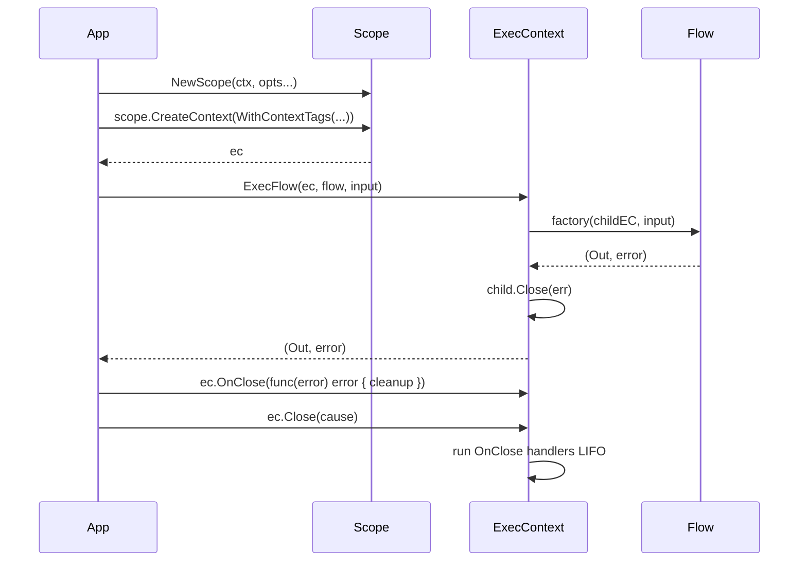
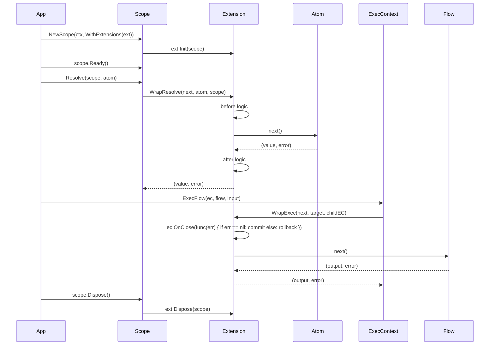
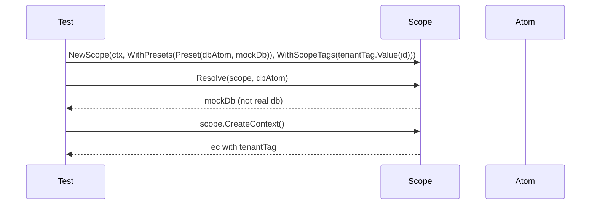
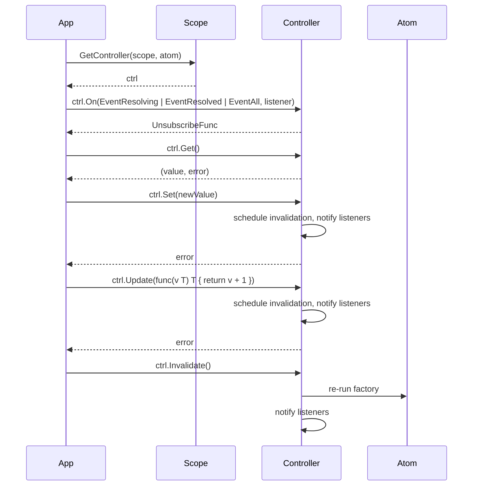
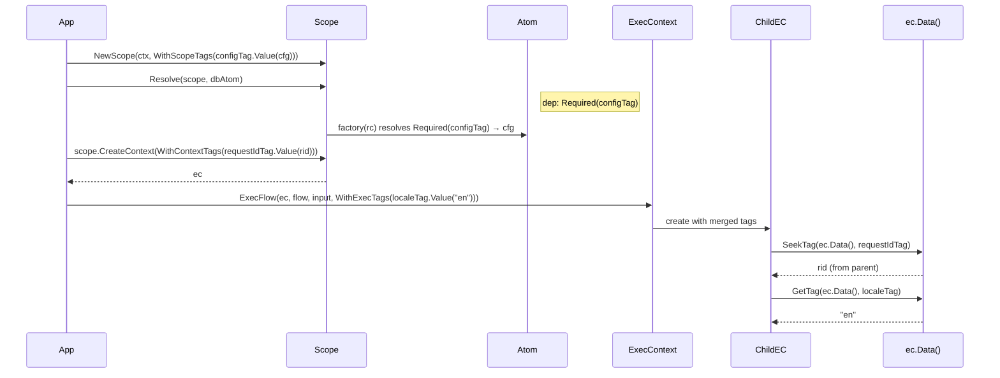
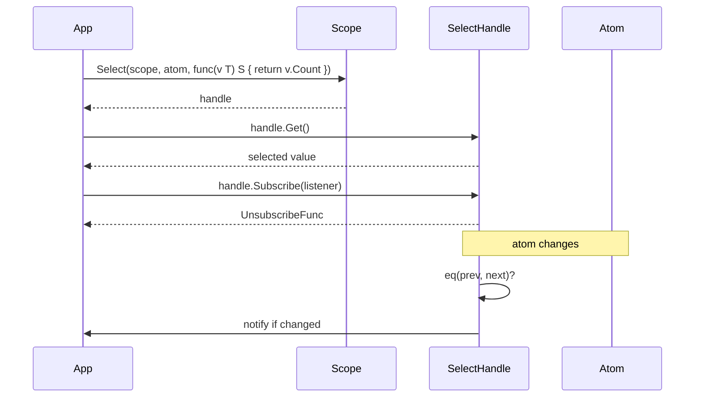
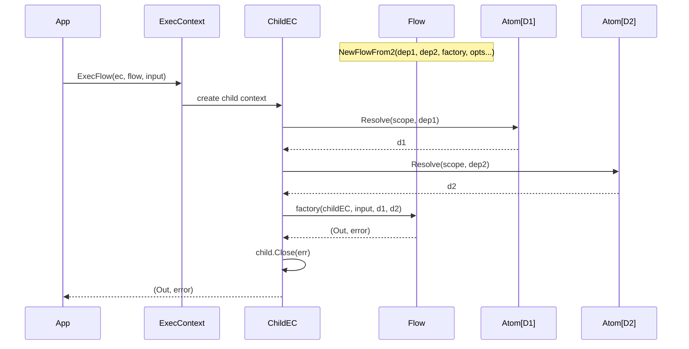
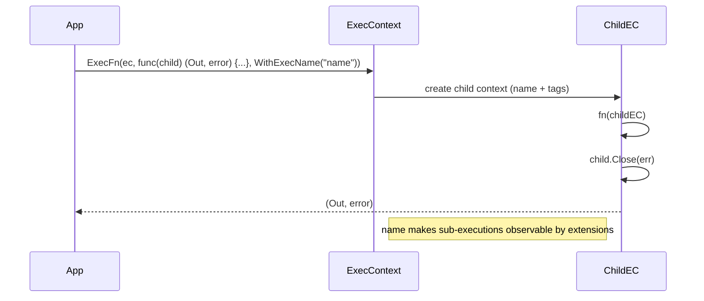
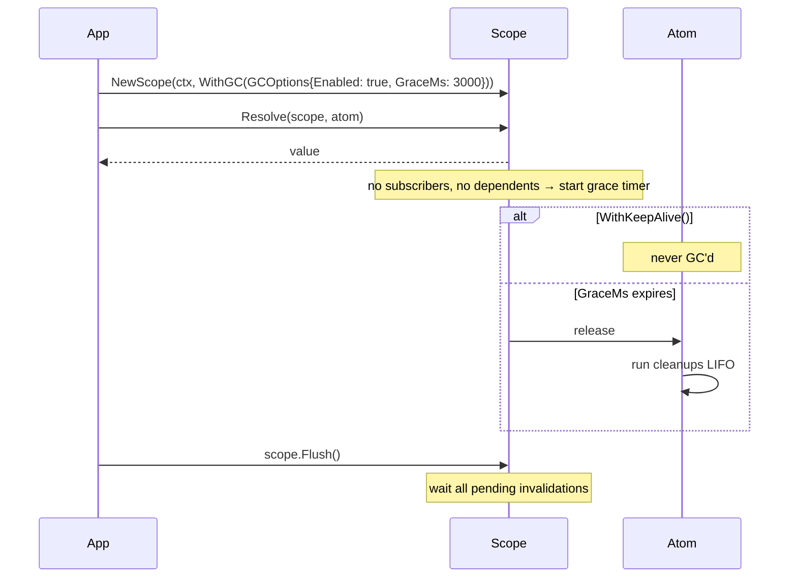

# Patterns

Usage patterns as sequences. For API details, see Go doc.

## A. Fundamental Usage

### Request Lifecycle

Model a request boundary with cleanup and shared context.

### Extensions Pipeline

Observe and wrap atoms/flows — logging, auth, tracing, transaction boundaries. Extensions register `OnClose(func(error) error)` to finalize based on success or failure.

### Scoped Isolation + Testing

Swap implementations and isolate tenants/tests.

## B. Advanced Usage

### Controller Reactivity

Mutable state with lifecycle hooks and invalidation.

### Ambient Context (Tags)

Propagate values without wiring parameters. Tags serve two roles: scope-level config (consumed by atoms via `Required(tag)`) and per-context ambient data (requestId, locale). Use `Required(tag)` as an atom dependency to declare that an atom or flow needs an ambient value — extensions or context setup provide the value, the consumer just depends on it.

### Derived State (Select)

Subscribe to a slice of atom state with custom equality.

### Typed Flow Dependencies (NewFlowFrom2)

Resolve atom dependencies automatically before the flow factory runs.

### Inline Function Execution (ExecFn)

Execute ad-hoc logic within context without defining a flow.

### Atom Retention (GC)

Control when atoms are garbage collected or kept alive indefinitely.

