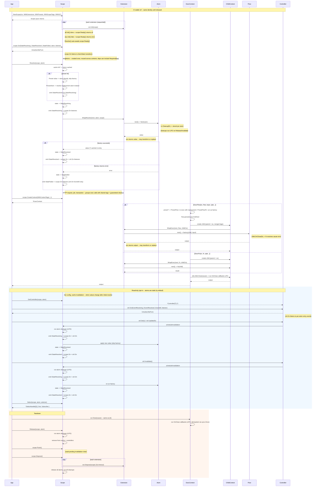

# flux

**Scoped Ambient State** for Go -- a scope-local atom graph with explicit dependencies and opt-in reactivity.

State lives in the scope, not in the caller. Handlers observe -- they don't own or construct dependencies. The same graph works across HTTP servers, background jobs, CLI tools, and tests.

**Servers** -- atoms are infrastructure singletons (db pool, cache client, config). Runtime config enters the scope as tags; atoms consume it via `Required(tag)`. Contexts bound per request carry tags (tenantId, traceId) without parameter drilling. Extensions wrap every resolve/exec for logging, tracing, auth. Cleanup is guaranteed.

**Workers** -- atoms form a dependency graph (`processor <- queue <- config`). Controllers enable live config reload; invalidation cascades to dependents automatically. Workers are projections of state, not owners.

**Both** -- presets swap any atom/flow for testing or multi-tenant isolation. Tags carry runtime config; presets replace implementations. No mocks, no test-only code paths.

```
go get github.com/pumped-fn/flux
```

## How It Works



API reference: `go doc github.com/pumped-fn/flux` | Patterns: `PATTERNS.md` | Examples: `examples/`

## License

MIT
