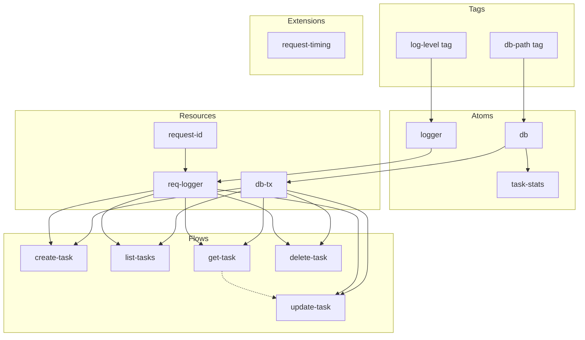

# Task Manager Example

A SQLite-backed task management API that demonstrates all flux primitives: tags, atoms, resources, flows, controllers, select, and extensions.

## Usage

### Seed and demo CRUD

```bash
go run . run
```

Runs a full lifecycle demo: creates a database, seeds sample tasks, performs CRUD operations, and prints results.

### HTTP server

```bash
go run . serve :8080
```

Starts an HTTP server on the given address.

## API Endpoints

| Method | Path | Description |
|--------|------|-------------|
| POST | /tasks | Create a new task |
| GET | /tasks | List all tasks |
| GET | /tasks/{id} | Get a task by ID |
| PATCH | /tasks/{id} | Update a task |
| DELETE | /tasks/{id} | Delete a task |
| GET | /stats | Get task statistics |

## Environment Variables

| Variable | Default | Description |
|----------|---------|-------------|
| FLUX_DB_PATH | tasks.db | Path to the SQLite database file |
| LOG_LEVEL | debug | Log verbosity (debug, info, warn, error) |

## Architecture


